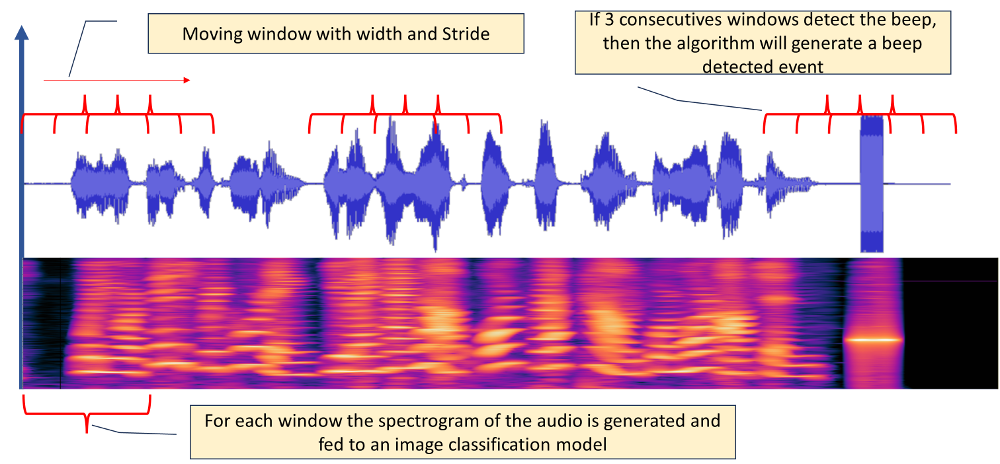
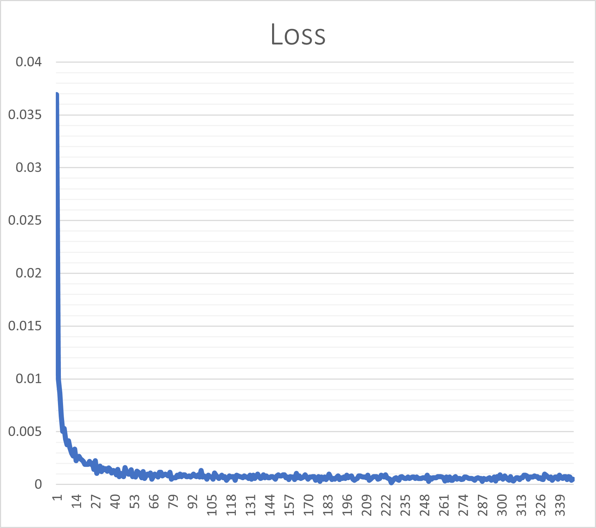

# doeswavhaveabeep
Utilize Convolutional Neural Networks (CNN) to perform the identification of a designated sound, specifically a beep, within a WAV file. The implementation necessitates the use of Python 3.8 and PyTorch, as detailed in the accompanying requirement.txt file.

The detection process unfolds through the following steps:

**Moving Window Process:**
The WAV file undergoes a moving window process characterized by a defined window length and movement stride.

**Preprocessing and Spectrogram Conversion:**
Each window extracted from the WAV file undergoes preprocessing procedures.
The window is then converted into its spectrogram representation.

**Model Inference:**
The resulting spectrogram is fed into the CNN model for inference.

**Detection Criteria:**
The detection software systematically monitors five adjacent windows.
If a beep is identified in more than three of these closely observed windows, the overall process triggers the output of detection results.

In order to implement this solution, ensure that Python 3.8 and PyTorch are installed, and refer to the requirement.txt file for additional details. This approach facilitates a dynamic and effective detection mechanism, emphasizing the monitoring of multiple sequential windows to enhance the accuracy and reliability of the beep detection process. 

The main algorithm can be tested using **processwav.ipynb**

NOTE:
To quickly test the project skip the following sections:

-Prepare data for the Training process

-Preparing data for validating the model

-Test the data generation process for a single file

-Train the model (There is already a trained model that can be used)

-Validate the model (same as above)

# Processing of data and project setup

As part of the overal process the notebook expects to create 2 directories:

inputrawwav_val  (it will contain the wav files for the validation process)
inputrawwav      (it will contain the wav files for the training process)

The user will need to create in each directory a CSV file called
wavlist.csv

The CSV file will contain information about the WAV file (filename,startbeep,stopbeep).
filename  - filename
startbeep - beginning of the beep in the wav file  (-1 if no beep)
stopbeep  - end of the beep in the wav file (-1 if no beep)

example:

filename,startbeep,stopbeep
test_amd_2.wav,7.880,9.800
low-tone.wav,1.72,2.01
low-tone2.wav,1.72,2.15
sprint.wav,20.7,20.800
empty_2.wav,-1,-1

This file will be used to generate the data for training and validation.

# Prepare data for the Training|Validation process  

%run run.py -m train|val -ct -w 0.7 -s 0.08

This script in the notebook will prepare the data for the training process.

-m (mode)    will set the switch to "training mode" (train) or "validation mode" (val).
-w (window)  this is the window in seconds the wav file will be chunked and spectrogram generated.
-s (stride)  this is the stride in seconds for the moving window
-ct (cleartarget) the target folder will be cleared.

The script will create the folder outputpretrainwav (in train mode) outputpretrainwav_val (in validation mode)
These folders will contain the wav files for each combination of window & stride of the original file. Also the waslist.csv file will be created for each wav file.

# Train the model

This target in the notebook will trigger the train process and model weights created as STD_MODEL_WEIGHTS

# Validate the model

This target in the notebook will trigger the validation process and model weights created as STD_MODEL_WEIGHTS

# The models: 

## model_ep226_mom09.pth

The model_ep226_mom09 model weigths has been frozen after 226 epocs hitting a loss of ~0.0001. Good eh.. 

# Technical considerations:

This algorithm uses a [RESNET 34](https://en.wikipedia.org/wiki/Residual_neural_network "RESNET") network at the core.
Resnets are standard neural networks which have been used in the space of Image Classification and proven to be very effective.
They are not standard CNN networks as they add several "Residual blocks" where the input is brought forward skipping the layer.

